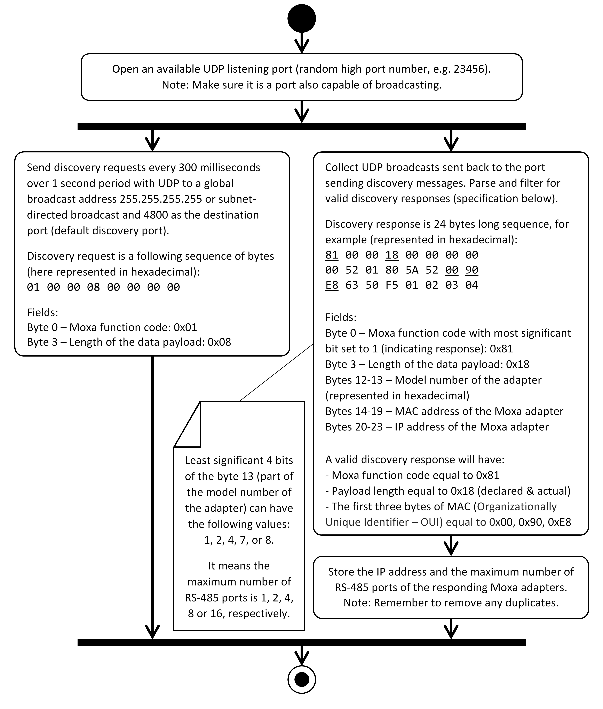

# OSRAM PHYTOFY® RL - Protocol Specification & System Integration (V1 - Dec 2019)


## Overview

This document is meant to provide insights into the OSRAM PHYTOFY® RL fixtures from the perspective of a system integrator. As such, the document covers the following topics:

* Overall system architecture (describing how the PHYTOFY® RL fixtures are connected)
* Protocol specification (for command and control of the fixtures)
* Guidelines for system commissioning (how to discover Moxa NPort® adapters; how to discover the attached fixtures and commission them)
* Definition of the related terminology and the algorithms needed for commissioning and providing user interface features.

The authors would also like to acknowledge and express the gratitude to everyone who contributed to this document, including (but not limited to): Yuchen Chen, David Hamby, Alan Sarkisian, John Selverian, Georg Wurth, Yi Zhang, et al.


## System Architecture

The system architecture (see Figure 1) can best be described as a set of four layers which include: fixtures, adapters, network and application.


**<center>Figure 1. System Architecture Diagram</center>**


### Fixtures Layer

The lowest layer of the architecture are fixtures, which feature only an RS-485 port in terms of connectivity out-of-the-box. This allows to daisy-chain multiple fixtures to avoid excessive cabling (note: the system uses RS-485 cables with 2 signal lines, D+ and D-, and single ground). Up to 80-100 fixtures can be connected to one RS-485 port through daisy-chaining. One end of the daisy-chain must end with the supplied terminator (as required by the RS-485 standard) while the other end can be used for communication with the fixtures.


### Adapters Layer

While it is possible to communicate directly with the fixtures over the RS-485 cable, in practice it is more convenient to use a computer network instead. To accomplish that, it is necessary to use an adapter which converts communication traffic between RS-485 and Ethernet (IEEE 802.3) network. This role is fulfilled by the Moxa NPort® 5150A adapter which converts communication traffic in both directions Ethernet into RS-485 messages, and vice versa. For more details regarding the Moxa NPort® 5150A adapter, please see the datasheet: [https://www.moxa.com/Moxa/media/PDIM/S100000205/moxa-nport-5100a-series-datasheet-v1.0.pdf](https://www.moxa.com/Moxa/media/PDIM/S100000205/moxa-nport-5100a-series-datasheet-v1.0.pdf).

The Moxa NPort® 5150A adapter can be configured in a variety of ways. However, the recommended and tested configuration parameters is specified as follows:

**<center>Table 1. Moxa NPort® adapter configuration</center>**

| Device version:  |
| ---------------- |
| a) Firmware v1.4 |

| Network settings:                                        |
| -------------------------------------------------------- |
| a) Dynamic IP address obtained from a DHCP server        |
| b) Moxa NPort® adapter configured to act as a TCP server |
| c) Local listen port (for a single port device) is 4001  |
| d) Maximum number of connections is 1                    |
| e) TCP alive check timeout is 7 minutes                  |

| RS-485 bus configuration:   |
| --------------------------- |
| a) Baud rate of 921600 (1M) |
| b) No parity bit            |
| c) 8 data bits              |
| d) One (1) stop bit         |
| e) No flow control          |
| f) FIFO enabled             |
| g) RS-485 2 wire Interface  |

The configuration can be adjusted by using the Moxa NPort® Administration Suite (which can be downloaded at: [https://www.moxa.com/en/support/search?psid=50333](https://www.moxa.com/en/support/search?psid=50333)), or with a web interface (see Figure 1) exposed by the device itself (the IP address of the adapter can be found with the Moxa NPort® Device Search Utility, also to be downloaded from the same website).

While the Moxa NPort® 5150A adapter features only one RS-485 port (depicted by Moxa Adapter 1 on Figure 1) there are a couple more options to organize the network topology. The system is very flexible on this layer:

* with the Moxa NPort® 5200x Series it is possible to have two RS-485 ports (depicted by Moxa Adapter 2 on Figure 1)
* with the Moxa NPort® 5400 Series it is possible to have four RS-485 ports (depicted by Moxa Adapter N on Figure 1)
* with the Moxa NPort® 5600 Series it is possible to have eight or sixteen RS-485 ports


**<center>Figure 2. Moxa NPort® Device Web Interface</center>**


### Application Layer

The controlling devices (such as PC and laptop computers, smartphones, tablets, IoT gateways, etc.) belong to that layer. The selection of a controlling device is left up to the system integrator to fit the application in the best manner. The only requirement is that the controlling software running on the device must follow the protocol specification and commissioning sequence defined in the following paragraph.


### Control & Operation

The high-level control & operation of the system is depicted in Figure 3. The details for each of the blocks can be found in respective paragraphs.


**<center>Figure 3. High-level Control & Operation Activity Diagram</center>**


## Protocol & Commissioning

Communication with the system can be divided into three phases:

1. Moxa Discovery
2. Fixture Discovery & Commissioning
3. Fixture Command & Control

The first phase uses its own protocol (specific to Moxa) and allows to enumerate all Moxa adapters present on the network. Once that phase is completed the controlling software can move on to phase two - enumerating the fixtures connected to the Moxa adapters and commissioning each of them (by assigning them short fixture addresses). Finally, in phase three the software can control various aspects of the fixture operation (e.g. real-time or scheduled light control). Note: Last two phases use the same protocol (specific to OSRAM).

### Network Layer

With the communication traffic exposed over an Ethernet port it is possible to make the network topology even more flexible by connecting multiple Moxa NPort® adapters to a single network router (e.g. a WiFi access point). Thanks to the flexibility of the adapters they can be configured to connect to any preexisting or newly deployed computer network (with various topologies, subnet masks, etc.).

The router provides not only a single point of access to all adapters but also enables controlling PHYTOFY® RL fixtures with a greater variety of devices (PC and laptop computers, smartphones, tablets, IoT gateways, etc.).

### Moxa NPort® Adapter Discovery

In this phase, the control software needs to determine the number of Moxa adapters connected to the network as well as the type of each of the adapters. In short, the adapter discovery is a simple request-response sequence where a predefined message is broadcasted locally on the network and the present Moxa NPort® adapters respond identifying themselves.

Here is a list with the characteristics of this communication phase:

* Throughout this phase the UDP protocol is used
* The discovery request uses a global broadcast address (i.e. 255.255.255.255) or (preferably) a subnet-directed broadcast address and 4800 as the destination port number (on the MAC layer of the protocol the UDP datagram is then implicitly sent as an Ethernet broadcast packet)
* The discovery response contains the information regarding the type of the Moxa NPort® adapter which is important for the subsequent communication phases
* It is assumed here that the IP address was already assigned to the Moxa NPort® adapters - either automatically by means of a DHCP assignment when the adapter was connected to the network or statically by means of configuration by the system operator
* Little-endian byte order is used for all transferred messages

The complete activity diagram describing the Moxa NPort® adapter discovery can be found in Figure 4. The result of the discovery is a list of IP addresses of the discovered Moxa NPort® adapters along with the maximum number of RS-485 ports for each of them.

To raise the reliability of the discovery (in case a UDP packet with a discovery response is lost) one may consider the additional implementation options:

1. The discovery may be repeated multiple, finite number of times (with the set of discovered adapters accumulated over the multiple runs)
2. The discovery may be repeated periodically (with the set of discovered adapters accumulated over the successive runs and adapters removed from the set when the age of the most recent discovery of an adapter exceeds certain timeout)

Past this phase the communication with the fixtures daisy-chained behind the RS-485 ports of the Moxa adapters takes place over TCP. To initiate the communication the controlling software must open a TCP connection to the IP address of the Moxa adapter. It is recommended to keep the connection open to ensure no data is lost in either of the communication directions.

Each of the RS-485 ports on a Moxa adapter corresponds to one TCP port exposed by the device. The first RS-485 port is accessible at a TCP port number 4001 (see also Table 1 for a related Moxa adapter configuration entry), the second RS-485 port is accessible at a TCP port number 4002, and so on. The protocol for communicating over the TCP connection is described in the next paragraph. Please note that the Moxa adapters can also be configured for UDP communication as well - in that case, the same protocol is used.

Note: The Moxa NPort® adapter discovery must be repeated every time the network topology changes or an adapter is added or removed from the network.


**<center>Figure 4. Moxa NPort® Adapter Discovery Diagram</center>**


### PHYTOFY® RL Protocol Structure

Once the Moxa NPort® adapters are discovered and TCP connections are established with the RS-485 ports on the adapters, further communication follows the protocol structure described in Table 2. It is recommended to keep the connection open (and to automatically reconnect if the connection is lost) to ensure no data is lost in either of the communication directions. Little-endian byte order is used for all transferred messages.

**<center>Table 2. Message Structure</center>**

| **Packet Field**             | HEADER: Control Software IPv4 Address                                                                                                             | HEADER: Sequence Number                                                                    | HEADER: Fixture Address                                                                                                  | HEADER: Function Code  | PAYLOAD: Message Payload                  | CHECKSUM: CRC-16-IBM Checksum                           |
| ---------------------------- | ------------------------------------------------------------------------------------------------------------------------------------------------- | ------------------------------------------------------------------------------------------ | ------------------------------------------------------------------------------------------------------------------------ | ---------------------- | ----------------------------------------- | ------------------------------------------------------- |
| **Size of the Field**        | Array of 4 bytes                                                                                                                                  | 32-bit unsigned integer                                                                    | 8-bit unsigned integer                                                                                                   | 8-bit unsigned integer | Array of 0-255 bytes                      | 16-bit unsigned integer                                 |
| **Description of the Field** | IP of the device controlling the system (PC / Mobile / Tablet / IoT Gateway). Note: This field is only relevant if the protocol is used over UDP. | Unique message number used in by the control software to pair command with reply messages. | 0: Broadcast address; 1-247: Fixture address; 248-254: Reserved; 255: Factory default for replies prior to commissioning | 0 - 255                | Payload of the message (command / reply). | See "Appendix A: CRC Code Generation" for more details. |

With one exception each command message sent will result in the reception of 1 or more replies. In general, messages meant for broadcast on the RS-485 port (with 0 in the Fixture Address field) may receive the number of replies up to the number of fixtures daisy-chained to that port. Messages addressed to a specific fixture (with a value from the 1-247 range in the Fixture Address field) should receive just one reply. The replies will have the same value as the command in the following header fields: Control Software IPv4 Address, Sequence Number and Function Code.

The factory default value for the Fixture Address is 255. A value unique to a RS-485 port is meant to be assigned by the control software during the fixture discovery and commissioning phase (for details see paragraph "PHYTOFY® RL Fixture Discovery & Commissioning").

The meaning of various Function Code values along with the description of the associated payload (for both the command and the reply) is described in the next paragraph.


### PHYTOFY® RL Protocol Commands & Control

The protocol of the PHYTOFY® RL fixtures exposes a variety of functions including: real-time light control, scheduling (CRUD operations - create, read, update and delete - as well as stop and resume), querying on-board system information (calibration, temperature) as well as illuminance-related control. This paragraph describes the types of command messages which can be sent to the PHYTOFY® RL fixtures and their replies.


#### Function Code: 0 (FC0); Function Name: Set Module Calibration

_Command Payload_

The payload of the command has the following format:

| Module ID                                           | Calibration Parameters for the UV-A Channel | Calibration Parameters for the Blue Channel | Calibration Parameters for the Green Channel | Calibration Parameters for the Hyper-Red Channel | Calibration Parameters for the Far-Red Channel | Calibration Parameters for the White Channel |
| --------------------------------------------------- | ------------------------------------------- | ------------------------------------------- | -------------------------------------------- | ------------------------------------------------ | ---------------------------------------------- | -------------------------------------------- |
| 8-bit unsigned integer value equal either to 0 or 1 | See format below                            | See format below                            | See format below                             | See format below                                 | See format below                               | See format below                             |

Calibration Parameters field for each color channel have the following format:

| Coefficient a               | Coefficient b               | Maximum Module Illuminance M |
| --------------------------- | --------------------------- | -----------------------------|
| 32-bit floating point value | 32-bit floating point value | 32-bit floating point value  |

An example set of calibration values is provided in "Appendix B: Example Calibration Parameters". Please mind that these values are not a usable replacement for properly calibrated ones.

_Reply Payload_

The payload of the reply can have one of the two possible formats:

1. Success (ACK):

| ACK                                     |
| --------------------------------------- |
| 8-bit unsigned integer value equal to 1 |

2. Failure (NACK):

| NACK                                    | Error Code                   |
| --------------------------------------- | ---------------------------- |
| 8-bit unsigned integer value equal to 0 | 8-bit unsigned integer value |

List of possible error code values:

* 1 - sent if the length of the command payload is incorrect

_Notes_

* Prior to calibration at OSRAM the parameters are initialized to value 0
* The calibration curve is defined as a following formula: 

⚠ _WARNING_: FC0 is a factory call. It is meant to be used only by OSRAM personnel. Using this function with wrong values may result in damage to the fixture.


#### Function Code: 1 (FC1); Function Name: Get Module Calibration

_Command Payload_

The payload of the command has the following format:

| Module ID                                           |
| --------------------------------------------------- |
| 8-bit unsigned integer value equal either to 0 or 1 |

_Reply Payload_

The payload of the reply can have one of the two possible formats:

1. Success (Calibration Parameters):

| Module ID                                           | Calibration Parameters for the UV-A Channel | Calibration Parameters for the Blue Channel | Calibration Parameters for the Green Channel | Calibration Parameters for the Hyper-Red Channel | Calibration Parameters for the Far-Red Channel | Calibration Parameters for the White Channel |
| --------------------------------------------------- | ------------------------------------------- | ------------------------------------------- | -------------------------------------------- | ------------------------------------------------ | ---------------------------------------------- | -------------------------------------------- |
| 8-bit unsigned integer value equal either to 0 or 1 | See format below                            | See format below                            | See format below                             | See format below                                 | See format below                               | See format below                             |

Calibration Parameters field for each color channel have the following format:

| Coefficient a               | Coefficient b               | Maximum Module Illuminance M |
| --------------------------- | --------------------------- | -----------------------------|
| 32-bit floating point value | 32-bit floating point value | 32-bit floating point value  |

An example set of calibration values is provided in "Appendix B: Example Calibration Parameters". Please mind that these values are not a usable replacement for properly calibrated ones.

2. Failure (NACK):

| NACK                                    | Error Code                   |
| --------------------------------------- | ---------------------------- |
| 8-bit unsigned integer value equal to 0 | 8-bit unsigned integer value |

List of possible error code values:

* 1 - sent if the length of the command payload is incorrect

_Notes_

* Prior to calibration at OSRAM the parameters are initialized to value 0
* The calibration curve is defined as a following formula: 


#### Function Code: 2 (FC2); Function Name: Set Serial Number

_Command Payload_

The payload of the command has the following format:

| Serial Number                 |
| ----------------------------- |
| 32-bit unsigned integer value |

_Reply Payload_

The payload of the reply can have one of the two possible formats:

1. Success (ACK):

| ACK                                     |
| --------------------------------------- |
| 8-bit unsigned integer value equal to 1 |

2. Failure (NACK):

| NACK                                    | Error Code                   |
| --------------------------------------- | ---------------------------- |
| 8-bit unsigned integer value equal to 0 | 8-bit unsigned integer value |

List of possible error code values:
* 1 - sent if the length of the command payload is incorrect

_Notes_

* The serial number referred to here is also the one listed on the label affixed to the fixture

⚠ _WARNING_: FC2 is a factory call. It is meant to be used only by OSRAM personnel. Using this function with wrong value may render the fixture unresponsive.


#### Function Code: 3 (FC3); Function Name: Get Serial Number

_Command Payload_

The payload of the command has the following format:

| Back-off Timing                                                                         |
| --------------------------------------------------------------------------------------- |
| 8-bit unsigned integer value; 0 = back-off timing disabled, 1 = back-off timing enabled |

_Reply Payload_

The payload of the reply has the following format (Serial Number):

| Serial Number                 |
| ----------------------------- |
| 32-bit unsigned integer value |

_Notes_

* The serial number referred to here is also the one listed on the label affixed to the fixture
* For commissioning, the control software sends a broadcast command message (Fixture Address field set to 0). The fixtures reply using random back-off timing (if enabled) with their serial numbers. Fixture replies with its currently assigned fixture address if already commissioned, or reserved address 255 if not


#### Function Code 4: (FC4); Function Name: Set Fixture Address

_Command Payload_

The payload of the command has the following format:

| Serial Number                 | Fixture Address                       |
| ----------------------------- | ------------------------------------- |
| 32-bit unsigned integer value | 8-bit unsigned integer value; (1-247) |

_Reply Payload_

The payload of the reply can have one of the two possible formats:

1. Success (ACK):

| ACK                                     |
| --------------------------------------- |
| 8-bit unsigned integer value equal to 1 |

2. Failure (NACK):

| NACK                                    | Error Code                   |
| --------------------------------------- | ---------------------------- |
| 8-bit unsigned integer value equal to 0 | 8-bit unsigned integer value |

List of possible error code values:

* 1 - sent if the length of the command payload is incorrect

_Notes_

* This command must be broadcasted (use 0 for the Fixture Address field in the header), only fixture with a matching serial number will reply
* After a positive reply (ACK), fixture does not reply to FC3 commissioning query for a duration of 5-second time window
* Allowed range for the Fixture Address: 1-247


#### Function Code: 5 (FC5); Function Name: Get Fixture Address

_Command Payload_

The payload of the command has the following format:

| Serial Number                 |
| ----------------------------- |
| 32-bit unsigned integer value |

_Reply Payload_

The payload of the reply can have one of the two possible formats:

1. Success (Fixture Address):

| Fixture Address              | Serial Number                 |
| ---------------------------- | ----------------------------- |
| 8-bit unsigned integer value | 32-bit unsigned integer value |

2. Failure (NACK):

| NACK                                    | Error Code                   |
| --------------------------------------- | ---------------------------- |
| 8-bit unsigned integer value equal to 0 | 8-bit unsigned integer value |

List of possible error code values:

* 0 - sent if the serial number in the payload does not match the serial number of the fixture the command was sent to (i.e. when the command was not broadcasted)
* 1 - sent if the length of the command payload is incorrect

_Notes_

* This command must be broadcasted (use 0 for the Fixture Address field in the header)


#### Function Code: 6 (FC6); Function Name: Set Group ID

_Command Payload_

The payload of the command has the following format:

| Group ID                      |
| ----------------------------- |
| 32-bit unsigned integer value |

_Reply Payload_

The payload of the reply can have one of the two possible formats:

1. Success (ACK):

| ACK                                     |
| --------------------------------------- |
| 8-bit unsigned integer value equal to 1 |

2. Failure (NACK):

| NACK                                    | Error Code                   |
| --------------------------------------- | ---------------------------- |
| 8-bit unsigned integer value equal to 0 | 8-bit unsigned integer value |

List of possible error code values:

* 1 - sent if the length of the command payload is incorrect

_Notes_

* Group ID of value 0 (factory default) indicates no group assignment


#### Function Code: 7 (FC7); Function Name: Get Group ID

_Command Payload_

The payload of the command is empty (zero-length)

_Reply Payload_

The payload of the reply has the following format (Group ID):

| Group ID                      |
| ----------------------------- |
| 32-bit unsigned integer value |

_Notes_

* Group ID of value 0 (factory default) indicates no group assignment


#### Function Code: 8 (FC8); Function Name: Set Fixture Info

_Command Payload_

The payload of the command has the following format:

| Firmware Version              | Hardware Version              |
| ----------------------------- | ----------------------------- |
| 32-bit unsigned integer value | 32-bit unsigned integer value |

_Reply Payload_

The payload of the reply can have one of the two possible formats:

1. Success (ACK):

| ACK                                     |
| --------------------------------------- |
| 8-bit unsigned integer value equal to 1 |

2. Failure (NACK):

| NACK                                    | Error Code                   |
| --------------------------------------- | ---------------------------- |
| 8-bit unsigned integer value equal to 0 | 8-bit unsigned integer value |

List of possible error code values:

* 1 - sent if the length of the command payload is incorrect

_Notes_
* The serial number referred to here is also the one listed on the label affixed to the fixture

⚠ _WARNING_: FC8 is a factory call. It is meant to be used only by OSRAM personnel. Using this function with wrong values may make it impossible to update the fixture firmware.


#### Function Code: 9 (FC9); Function Name: Get Fixture Info

_Command Payload_

The payload of the command is empty (zero-length)

_Reply Payload_

The payload of the reply has the following format (FW & HW versions; Maximum fixture illuminance values for each of the channels in):

| Firmware Version              | Hardware Version              | Maximum Fixture Illuminance (Imax) for the UV-A Channel | Maximum Fixture Illuminance (Imax) for the Blue Channel   | Maximum Fixture Illuminance (Imax) for the Green Channel | Maximum Fixture Illuminance (Imax) for the Hyper-Red Channel | Maximum Fixture Illuminance (Imax) for the Far-Red Channel | Maximum Fixture Illuminance (Imax) for the White Channel |
| ----------------------------- | ----------------------------- | ------------------------------------------------------- | --------------------------------------------------------- | -------------------------------------------------------- | ------------------------------------------------------------ | ---------------------------------------------------------- | -------------------------------------------------------- |
| 32-bit unsigned integer value | 32-bit unsigned integer value | 32-bit floating point value                             | 32-bit floating point value                               | 32-bit floating point value                              | 32-bit floating point value                                  | 32-bit floating point value                                | 32-bit floating point value                              |

_Notes_

* For more details see the paragraph: "Adjusting Illuminance Scaling"
* The maximum fixture illuminance values depend on the configuration coefficients set with the command FC24
* Fixture calculates the maximum illuminance given both of its modules. For every channel it picks the minimum of the maximum values calculated for each of the two modules


#### Function Code: 10 (FC10); Function Name: Set Time Reference

_Command Payload_

The payload of the command has the following format:

| Unix Time (seconds)           |
| ----------------------------- |
| 32-bit unsigned integer value |

_Reply Payload_

The payload of the reply can have one of the two possible formats:

1. Success (ACK):

| ACK                                     |
| --------------------------------------- |
| 8-bit unsigned integer value equal to 1 |

2. Failure (NACK):

| NACK                                    | Error Code                   |
| --------------------------------------- | ---------------------------- |
| 8-bit unsigned integer value equal to 0 | 8-bit unsigned integer value |

List of possible error code values:

* 1 - sent if the length of the command payload is incorrect

_Notes_

* This command sets the fixture clock used by the scheduling functionality
* Time is expressed in number seconds elapsed since the Unix Epoch (1st of Jan 1970, 00:00:00 UTC)
* It is recommended to synchronize the clocks of the fixtures at regular intervals (extended periods of power outage may cause excessive clock drift otherwise)


#### Function Code: 11 (FC11); Function Name: Get Time Reference

_Command Payload_

The payload of the command is empty (zero-length)

_Reply Payload_

The payload of the reply has the following format (Unix Time):

| Unix Time (seconds)           |
| ----------------------------- |
| 32-bit unsigned integer value |

_Notes_

* Time is expressed in number seconds elapsed since the Unix Epoch (1st of Jan 1970, 00:00:00 UTC)


#### Function Code: 12 (FC12); Function Name: Set LEDs (Real-time Control)

_Command Payload_

The payload of the command can have one of the two possible formats:

1. Individual fixture control:

| Config                       | UV-A Channel | Blue Channel | Green Channel | Hyper-Red Channel | Far-Red Channel | White Channel |
| ---------------------------- | ------------ | ------------ | ------------- | ----------------- | --------------- | ------------- |
| 8-bit unsigned integer value | 32-bit value | 32-bit value | 32-bit value  | 32-bit value      | 32-bit value    | 32-bit value  |

2. Fixture group control:

| Group ID                      | Config                       | UV-A Channel | Blue Channel | Green Channel | Hyper-Red Channel | Far-Red Channel | White Channel |
| ----------------------------- | ---------------------------- | ------------ | ------------ | ------------- | ----------------- | --------------- | ------------- |
| 32-bit unsigned integer value | 8-bit unsigned integer value | 32-bit value | 32-bit value | 32-bit value  | 32-bit value      | 32-bit value    | 32-bit value  |

The Config field is bit field with the following format:

| Bit 7: Reserved | Bit 6: Reserved | Bit 5: Reserved | Bit 4: Reserved | Bit 3: Reserved | Bit 2: Channel Value Format | Bit 1: Enable Module 1 | Bit 0: Enable Module 0 |
| --------------- | --------------- | --------------- | --------------- | --------------- | --------------------------- | ---------------------- | ---------------------- |
|                 |                 |                 |                 |                 |                             | 0=off, 1=on            | 0=off, 1=on            |

Channel value formats:

* 0 - Unsigned integer format with the PWM% lighting value (on a scale of 0-100)
* 1 - Floating point format with the lighting illuminance value I

_Reply Payload_

For this command there is no reply is sent from the fixture

_Notes_

* To make sure the command has an effect the scheduling must be stopped (using the FC20 command)
* To ensure proper operation, the sum of PWM% levels across all color channels must be less than 300
* The illuminance values for the respective channels must be in the range from 0 to the value returned by the FC9 command and depend on the illuminance configuration coefficients supplied by the control software as outlined in paragraph "Adjusting Illuminance Scaling"
* Variant 1 of the command is meant to be used with a specific fixture address (from the 1-247 range)
* Variant 2 of the command is meant to be sent as a broadcast message (using fixture address 0)
* If Fixture Address = 0 and Group ID = 0, all fixtures are addressed
* Because for this command there is no reply is sent from the fixture, one might choose to use the FC13 (Get LEDs) command to verify if the settings were applied successfully


#### Function Code: 13 (FC13); Function Name: Get LEDs (Real-time Control)

_Command Payload_

The payload of the command is empty (zero-length)

_Reply Payload_

The payload of the reply has the following format (individual fixture control):

| Config                       | UV-A Channel | Blue Channel | Green Channel | Hyper-Red Channel | Far-Red Channel | White Channel |
| ---------------------------- | ------------ | ------------ | ------------- | ----------------- | --------------- | ------------- |
| 8-bit unsigned integer value | 32-bit value | 32-bit value | 32-bit value  | 32-bit value      | 32-bit value    | 32-bit value  |

The Config field is bit field with the following format:

| Bit 7: Reserved | Bit 6: Reserved | Bit 5: Reserved | Bit 4: Reserved | Bit 3: Reserved | Bit 2: Channel Value Format | Bit 1: Enable Module 1 | Bit 0: Enable Module 0 |
| --------------- | --------------- | --------------- | --------------- | --------------- | --------------------------- | ---------------------- | ---------------------- |
|                 |                 |                 |                 |                 |                             | 0=off, 1=on            | 0=off, 1=on            |

Channel value formats:

* 0 - Unsigned integer format with the PWM% lighting value (on a scale of 0-100)
* 1 - Floating point format with the lighting illuminance value I

_Notes_

* The command is effective during real-time as well as scheduled control
* The respective illuminance values will be in in the range from 0 to the value returned by the FC9 command and depend on the illuminance configuration coefficients supplied by the control software as outlined in paragraph "Adjusting Illuminance Scaling"


#### Function Code: 14 (FC14); Function Name: Set Schedule

_Command Payload_

The payload of the command has the following format:

| Schedule ID                   | Begin Date-time               | End Date-time                 | Config                       | UV-A Channel | Blue Channel | Green Channel | Hyper-Red Channel | Far-Red Channel | White Channel |
| ----------------------------- | ----------------------------- | ----------------------------- | ---------------------------- | ------------ | ------------ | ------------- | ----------------- | --------------- | ------------- |
| 32-bit unsigned integer value | 32-bit unsigned integer value | 32-bit unsigned integer value | 8-bit unsigned integer value | 32-bit value | 32-bit value | 32-bit value  | 32-bit value      | 32-bit value    | 32-bit value  |

The Config field is bit field with the following format:

| Bit 7: Reserved | Bit 6: Reserved | Bit 5: Reserved | Bit 4: Reserved | Bit 3: Reserved | Bit 2: Channel Value Format | Bit 1: Enable Module 1 | Bit 0: Enable Module 0 |
| --------------- | --------------- | --------------- | --------------- | --------------- | --------------------------- | ---------------------- | ---------------------- |
|                 |                 |                 |                 |                 |                             | 0=off, 1=on            | 0=off, 1=on            |

Channel value formats:

* 0 - Unsigned integer format with the PWM% lighting value (on a scale of 0-100)
* 1 - Floating point format with the lighting illuminance value I

_Reply Payload_

The payload of the reply can have one of the two possible formats:

1. Success (ACK):

| ACK                                     |
| --------------------------------------- |
| 8-bit unsigned integer value equal to 1 |

2. Failure (NACK):

| NACK                                    | Error Code                   |
| --------------------------------------- | ---------------------------- |
| 8-bit unsigned integer value equal to 0 | 8-bit unsigned integer value |

List of possible error code values:

* 0 - sent if the insertion of the schedule was unsuccessful (i.e. the number of schedules reached 200)
* 1 - sent if the length of the command payload is incorrect

_Notes_

* Adding a schedule does not resume scheduling (this can be accomplished by using the FC21 command)
* To ensure proper operation, the sum of PWM% levels across all color channels must be less than 300
* The illuminance values for the respective channels must be in the range from 0 to the value returned by the FC9 command and depend on the illuminance configuration coefficients supplied by the control software as outlined in paragraph "Adjusting Illuminance Scaling"
* The lighting settings will be repeating each day from the begin date until the end date (including both). During the day the lighting settings will be active from the begin time until the end time.
* Date-time is expressed in number seconds elapsed since the Unix Epoch (1st of Jan 1970, 00:00:00 UTC)
* Elapsed schedules are deleted automatically


#### Function Code: 15 (FC15); Function Name: Get Schedule

_Command Payload_

The payload of the command has the following format:

| Schedule Key                  | Schedule Key Type            |
| ----------------------------- | ---------------------------- |
| 32-bit unsigned integer value | 8-bit unsigned integer value |

Schedule key type can have the following values:

* 0 - Schedule ID
* 1 - Schedule array index

_Reply Payload_

The payload of the reply can have one of the two possible formats:

1. Success (Schedule):

| Schedule ID                   | Begin Date-time               | End Date-time                 | Config                       | UV-A Channel | Blue Channel | Green Channel | Hyper-Red Channel | Far-Red Channel | White Channel |
| ----------------------------- | ----------------------------- | ----------------------------- | ---------------------------- | ------------ | ------------ | ------------- | ----------------- | --------------- | ------------- |
| 32-bit unsigned integer value | 32-bit unsigned integer value | 32-bit unsigned integer value | 8-bit unsigned integer value | 32-bit value | 32-bit value | 32-bit value  | 32-bit value      | 32-bit value    | 32-bit value  |

The Config field is bit field with the following format:

| Bit 7: Reserved | Bit 6: Reserved | Bit 5: Reserved | Bit 4: Reserved | Bit 3: Reserved | Bit 2: Channel Value Format | Bit 1: Enable Module 1 | Bit 0: Enable Module 0 |
| --------------- | --------------- | --------------- | --------------- | --------------- | --------------------------- | ---------------------- | ---------------------- |
|                 |                 |                 |                 |                 |                             | 0=off, 1=on            | 0=off, 1=on            |

Channel value formats:

* 0 - Unsigned integer format with the PWM% lighting value (on a scale of 0-100)
* 1 - Floating point format with the lighting illuminance value I

2. Failure (NACK):

| NACK                                    | Error Code                   |
| --------------------------------------- | ---------------------------- |
| 8-bit unsigned integer value equal to 0 | 8-bit unsigned integer value |

List of possible error code values:

* 0 - sent if the given schedule key is missing (either unknown schedule ID or an out-of-bound index)
* 1 - sent if the length of the command payload is incorrect

_Notes_

* The illuminance values for the respective channels will be in the range from 0 to the value returned by the FC9 command and depend on the illuminance configuration coefficients supplied by the control software as outlined in paragraph "Adjusting Illuminance Scaling"
* Date-time is expressed in number seconds elapsed since the Unix Epoch (1st of Jan 1970, 00:00:00 UTC)


#### Function Code: 16 (FC16); Function Name: Get Schedule Count

_Command Payload_

The payload of the command is empty (zero-length)

_Reply Payload_

The payload of the reply has the following format (Schedule Count):

| Schedule Count                |
| ----------------------------- |
| 32-bit unsigned integer value |

_Notes_

N/A


#### Function Code: 17 (FC17); Function Name: Get Scheduling State

_Command Payload_

The payload of the command is empty (zero-length)

_Reply Payload_

The payload of the reply has the following format (Schedule Count):

| Scheduling State             | Active Schedule ID            |
| ---------------------------- | ----------------------------- |
| 8-bit unsigned integer value | 32-bit unsigned integer value |

List of possible scheduling state values:

* 0 - scheduling is stopped
* 1 - scheduling is resumed (but running without a schedule)
* 2 - scheduling is resumed (and running with a schedule with the provided ID)

_Notes_

N/A


#### Function Code: 18 (FC18); Function Name: Delete Schedule

_Command Payload_

The payload of the command has the following format:

| Schedule ID                   |
| ----------------------------- |
| 32-bit unsigned integer value |

_Reply Payload_

The payload of the reply can have one of the two possible formats:

1. Success (ACK):

| ACK                                     |
| --------------------------------------- |
| 8-bit unsigned integer value equal to 1 |

2. Failure (NACK):

| NACK                                    | Error Code                   |
| --------------------------------------- | ---------------------------- |
| 8-bit unsigned integer value equal to 0 | 8-bit unsigned integer value |

List of possible error code values:

* 0 - sent if the given schedule key is missing (either unknown schedule ID or an out-of-bound index)
* 1 - sent if the length of the command payload is incorrect

_Notes_

* Deletes a particular schedule with the specified ID from a fixture


#### Function Code: 19 (FC19); Function Name: Delete All Schedules

_Command Payload_

The payload of the command is empty (zero-length)

_Reply Payload_

The payload of the reply has the following format (ACK):

| ACK                                     |
| --------------------------------------- |
| 8-bit unsigned integer value equal to 1 |

_Notes_

* Deletes all schedules stored on a fixture


#### Function Code: 20 (FC20); Function Name: Stop Scheduling

_Command Payload_

The payload of the command is empty (zero-length)

_Reply Payload_

The payload of the reply has the following format (ACK):

| ACK                                     |
| --------------------------------------- |
| 8-bit unsigned integer value equal to 1 |

_Notes_

* If schedules are currently running, they will turn off until scheduling is resumed
* The duration of the time when scheduling is stopped will not be added to the remainder of the schedule for the day


#### Function Code: 21 (FC21); Function Name: Resume Scheduling

_Command Payload_

The payload of the command is empty (zero-length)

_Reply Payload_

The payload of the reply has the following format (ACK):

| ACK                                     |
| --------------------------------------- |
| 8-bit unsigned integer value equal to 1 |

_Notes_

* This will cause the fixture to resume its scheduling if it had been previously stopped with FC20.


#### Function Code: 24 (FC24); Function Name: Set Illuminance Configuration

_Command Payload_

The payload of the command has the following format:

| Illuminance Factor (K) for the UV-A Channel | Illuminance Factor (K) for the Blue Channel | Illuminance Factor (K) for the Green Channel | Illuminance Factor (K) for the Hyper-Red Channel | Illuminance Factor (K) for the Far-Red Channel | Illuminance Factor (K) for the White Channel |
| ------------------------------------------- | ------------------------------------------- | -------------------------------------------- | ------------------------------------------------ | ---------------------------------------------- | -------------------------------------------- |
| 32-bit floating point value                 | 32-bit floating point value                 | 32-bit floating point value                  | 32-bit floating point value                      | 32-bit floating point value                    | 32-bit floating point value                  |

_Reply Payload_

The payload of the reply can have one of the two possible formats:

1. Success (ACK):

| ACK                                     |
| --------------------------------------- |
| 8-bit unsigned integer value equal to 1 |

2. Failure (NACK):

| NACK                                    | Error Code                   |
| --------------------------------------- | ---------------------------- |
| 8-bit unsigned integer value equal to 0 | 8-bit unsigned integer value |

List of possible error code values:

* 1 - sent if the length of the command payload is incorrect

_Notes_

* For more details regarding the calculation of the illuminance factor K see the paragraph: "Adjusting Illuminance Scaling"
* The default factory values for these are each set to 1.0


#### Function Code: 25 (FC25); Function Name: Get Illuminance Configuration

_Command Payload_

The payload of the command is empty (zero-length)

_Reply Payload_

The payload of the reply has the following format (Illuminance Configuration):

| Illuminance Factor (K) for the UV-A Channel | Illuminance Factor (K) for the Blue Channel | Illuminance Factor (K) for the Green Channel | Illuminance Factor (K) for the Hyper-Red Channel | Illuminance Factor (K) for the Far-Red Channel | Illuminance Factor (K) for the White Channel |
| ------------------------------------------- | ------------------------------------------- | -------------------------------------------- | ------------------------------------------------ | ---------------------------------------------- | -------------------------------------------- |
| 32-bit floating point value                 | 32-bit floating point value                 | 32-bit floating point value                  | 32-bit floating point value                      | 32-bit floating point value                    | 32-bit floating point value                  |

_Notes_

* For more details regarding the calculation of the illuminance factor K see the paragraph: "Adjusting Illuminance Scaling"
* The default factory values for these are set to 1.0


#### Function Code: 26 (FC26); Function Name: Get Module Temperature

_Command Payload_

The payload of the command is empty (zero-length)

_Reply Payload_

The payload of the reply has the following format (Module Temperature):

| Channel Temperatures for Module 0 | Channel Temperatures for Module 1 |
| --------------------------------- | --------------------------------- |
| See format below                  | See format below                  |

Channel Temperatures field for each module have the following format:

| Temperature for the UV-A Channel | Temperature for the Blue Channel | Temperature for the Green Channel | Temperature for the Hyper-Red Channel | Temperature for the Far-Red Channel | Temperature for the White Channel |
| -------------------------------- | -------------------------------- | --------------------------------- | ------------------------------------- | ----------------------------------- | --------------------------------- |
| 32-bit floating point value      | 32-bit floating point value      | 32-bit floating point value       | 32-bit floating point value           | 32-bit floating point value         | 32-bit floating point value       |

_Notes_

N/A


#### Function Code: 27 (FC27); Function Name: Toggle Calibration

_Command Payload_

The payload of the command has the following format:

| Calibration Toggle           |
| ---------------------------- |
| 8-bit unsigned integer value |

List of possible calibration toggle values:

* 0 - enable calibration
* 1 - disable calibration

_Reply Payload_

The payload of the reply can have one of the two possible formats:

1. Success (ACK):

| ACK                                     |
| --------------------------------------- |
| 8-bit unsigned integer value equal to 1 |

2. Failure (NACK):

| NACK                                    | Error Code                   |
| --------------------------------------- | ---------------------------- |
| 8-bit unsigned integer value equal to 0 | 8-bit unsigned integer value |

List of possible error code values:

* 1 - sent if the length of the command payload is incorrect

_Notes_

⚠ _WARNING_: FC27 is a factory call. It is meant to be used only by OSRAM personnel. Using this function incorrectly may invalidate the factory calibration values and break the illuminance lighting control functionality.


#### Function Code: 28 (FC28); Function Name: Set LED Voltages

_Command Payload_

The payload of the command has the following format:

| Voltage for the UV-A Channel | Voltage for the Blue Channel | Voltage for the Green Channel | Voltage for the Hyper-Red Channel | Voltage for the Far-Red Channel | Voltage for the White Channel |
| ---------------------------- | ---------------------------- | ----------------------------- | --------------------------------- | ------------------------------- | ----------------------------- |
| 32-bit floating point value  | 32-bit floating point value  | 32-bit floating point value   | 32-bit floating point value       | 32-bit floating point value     | 32-bit floating point value   |

_Reply Payload_

The payload of the reply can have one of the two possible formats:

1. Success (ACK):

| ACK                                     |
| --------------------------------------- |
| 8-bit unsigned integer value equal to 1 |

2. Failure (NACK):

| NACK                                    | Error Code                   |
| --------------------------------------- | ---------------------------- |
| 8-bit unsigned integer value equal to 0 | 8-bit unsigned integer value |

List of possible error code values:

* 1 - sent if the length of the command payload is incorrect

_Notes_

* The voltage values are used to calculate power for each channel: 
* The voltage values are used by the power limiter functionality
* The default values hardcoded in the firmware are: 14.0 for the UV-A channel, 50.4 for the blue channel, 54.0 for the green channel, 40.0 for the hyper-red channel, 23.4 for the far-red channel and 57.0 for the white channel
* The function has no relation to PWM% used by commands: FC12, FC13, FC14 and FC15

⚠ _WARNING_: FC28 is a factory call. It is meant to be used only by OSRAM personnel. Using this function incorrectly may cause the fixture to operate outside of the default limits (there is also a temperature-based protection in place which ensures safety).


#### Function Code: 29 (FC29); Function Name: Get LED Voltages

_Command Payload_

The payload of the command is empty (zero-length)

_Reply Payload_

The payload of the reply has the following format (Voltages):

| Voltage for the UV-A Channel | Voltage for the Blue Channel | Voltage for the Green Channel | Voltage for the Hyper-Red Channel | Voltage for the Far-Red Channel | Voltage for the White Channel |
| ---------------------------- | ---------------------------- | ----------------------------- | --------------------------------- | ------------------------------- | ----------------------------- |
| 32-bit floating point value  | 32-bit floating point value  | 32-bit floating point value   | 32-bit floating point value       | 32-bit floating point value     | 32-bit floating point value   |

_Notes_

* The voltage values are used to calculate power for each channel: 
* The voltage values are used by the power limiter functionality
* The function has no relation to PWM% used by commands: FC12, FC13, FC14 and FC15

⚠ _WARNING_: FC28 is a factory call. It is meant to be used only by OSRAM personnel. Using this function incorrectly may cause the fixture to operate outside of the default limits (there is also a temperature-based protection in place which ensures safety).


#### Function Code: 120 (FC120); Function Name: Get Power

_Command Payload_

The payload of the command is empty (zero-length)

_Reply Payload_

The payload of the reply has the following format (Power):

| Power                       |
| --------------------------- |
| 32-bit floating point value |

_Notes_

* This function can be used to obtain the calculated power (passed on the factory configured voltages)
* The function has no relation to PWM% used by commands: FC12, FC13, FC14 and FC15
* The returned value is indicating power per module (not for the whole luminaire)


#### Function Code: 200 (FC200); Function Name: Reset for Firmware Update

_Command Payload_

The payload of the command is empty (zero-length)

_Reply Payload_
The payload of the reply has the following format (ACK):

| ACK                                     |
| --------------------------------------- |
| 8-bit unsigned integer value equal to 1 |

_Notes_

* It is necessary to wait for ACK from the fixture before sending FC201

⚠ _WARNING_: FC200 is a firmware update call. It is meant to be used only with OSRAM-supplied software. Using this function incorrectly may render the fixture unresponsive.


#### Function Code: 201 (FC201); Function Name: Confirm Reset for Firmware Update

_Command Payload_

The payload of the command is empty (zero-length)

_Reply Payload_

No reply is sent back, since the fixture will enter the bootloader

_Notes_

* It is necessary to send this command within 1.5 seconds of ACK from FC200
* No reply is sent back, since the fixture will enter the bootloader

⚠ _WARNING_: FC201 is a firmware update call. It is meant to be used only with OSRAM-supplied software. Using this function incorrectly may render the fixture unresponsive.


### PHYTOFY® RL Fixture Discovery & Commissioning

In this phase, the control software needs to enumerate the fixtures connected to each of the ports on each Moxa adapter (after finishing with one port, the software needs to loop through all the other ports of that Moxa adapter and then loop similarly through all the other Moxa adapters). Once the fixtures are enumerated they need to be commissioned with a fixture address. The fixture address needs to be unique among the ones used on the RS-485 port to which the fixture is connected to.

Here is a list with the characteristics of this communication phase:
* Throughout this phase TCP protocol is used
* The discovery request uses the Get Serial Number (FC3) command (broadcasted) to enumerate the fixtures and the Set Fixture Address (FC4) command to assign a fixture address to each of them
* Little-endian byte order is used for all transferred messages

The complete activity diagram describing the Moxa NPort® adapter discovery can be found in Figure 5. After completing this phase, the system is ready for normal use.

To raise the reliability of the discovery (in case a FC3 reply is lost or corrupt in transmission) one may consider the additional implementation options:
1. The discovery may be repeated multiple, finite number of times (with the set of discovered fixtures accumulated over the multiple runs)
2. The discovery may be repeated periodically (with the set of discovered fixtures accumulated over the successive runs and fixtures removed from the set when the age of the most recent fixtures discovery exceeds certain timeout)

The commissioning step must be repeated every time for the following cases:
1. There are brand new, unassigned fixtures replaced or added to a RS-485 port
2. One or more fixtures were connected to a different RS-485 port


### Real-time Lighting Control

Real-time control allows each of the 6 color channels of PHYTOFY® RL to be controlled individually which enables the system to use settings specific to the user’s needs. Real-time control can be performed in two ways:

1. By controlling a color channel by setting PWM% level (in a range from 0 to 100%)
2. By controlling a color channel by setting the illuminance value I.

Each PHYTOFY® RL fixture is calibrated, with its performance parameters stored in the non-volatile memory on the device. These calibration values, as well as protocol commands detailed before (FC12 and FC13), allow the control software to uniformly control the illuminance each unit. Greater detail on this can be found in the paragraph: "Adjusting Illuminance Scaling".

Network load can vary case by case, however, regardless of the situation it is recommended to use a control rate not exceeding 20 Hz - e.g. for sending the Set LEDs (FC12) commands.


### Scheduled Lighting Control

PHYTOFY® RL is also capable of managing its own lighting state by using schedules. Schedules are managed with PHYTOFY® RL using the commands FC14 - FC21. Just like with real-time control the software can create a schedule with color channel settings using a PWM% level (in a range from 0 to 100%) or illuminance value (for the latter see the paragraph "Adjusting Illuminance Scaling" for more information).

Note that no more than 190 schedules can be stored on a PHYTOFY® RL fixture at any given time. However, once a schedule has elapsed, it is automatically deleted.


### Adjusting Illuminance Scaling

When controlling with a PWM% levels the actual performance may slightly differ from one fixture to another. Therefore, to ensure a uniform performance, the fixtures are calibrated and allow to be controlled with illuminance values I. Additional benefit of using illuminance-based control is that it can take advantage of all 256 discrete levels while PWM% offers only 100. The relationship between the two can be illustrated by going through the following steps.

1. The maximum illuminance values returned by the FC8 command are calculated by the fixture with the following formula (M₀ and M₁ are the Maximum Module Illuminance values returned by the FC1 command):


2. The fixture normalizes the illuminance values (passed either with the FC12 or the FC14 command) with the following formula:


3. The normalized illuminance values are converted by the fixture to PWM% levels with the following formula (a and b are the other values returned by the FC1 command):


The illuminance scaling can be adjusted with the coefficient K by calling the command FC24. For example, by setting it to 1⁄min(M₀,M₁) the illuminance values will roughly correspond to the PWM% levels (with the caveat that one is a linear function and the other a quadratic one. Another example would be to use the average values and standard deviations of the M coefficient (see "Appendix B: Example Calibration Parameters") to equalize the fixture performance.


## Appendices

This chapter contains secondary information adjacent to the primary subjects covered in this document.


### Appendix A: CRC Code Generation

The CRC (Cyclical Redundancy Check) code is a 16-bit, little-endian integer. It is used for validating the contents of a message sent from the control software to the fixtures, and vice versa. The validation check is performed on the concatenated header and payload of a message (transmitted over TCP), and the CRC code value follows the payload of the message.

For PHYTOFY® RL, the CRC-16-IBM variant is used (also known as CRC-16-ANSI) - with the following generating polynomial representation:


Note also that the protocol uses the normal representation (0x8005) with 0xFFFF as the initial value. For convenience, an optimized C# code implementing the CRC calculation is included below:

```cs
static readonly byte[] ChecksumLookUpLow = {
    0x00, 0xC0, 0xC1, 0x01, 0xC3, 0x03, 0x02, 0xC2,
    0xC6, 0x06, 0x07, 0xC7, 0x05, 0xC5, 0xC4, 0x04,
    0xCC, 0x0C, 0x0D, 0xCD, 0x0F, 0xCF, 0xCE, 0x0E,
    0x0A, 0xCA, 0xCB, 0x0B, 0xC9, 0x09, 0x08, 0xC8,
    0xD8, 0x18, 0x19, 0xD9, 0x1B, 0xDB, 0xDA, 0x1A,
    0x1E, 0xDE, 0xDF, 0x1F, 0xDD, 0x1D, 0x1C, 0xDC,
    0x14, 0xD4, 0xD5, 0x15, 0xD7, 0x17, 0x16, 0xD6,
    0xD2, 0x12, 0x13, 0xD3, 0x11, 0xD1, 0xD0, 0x10,
    0xF0, 0x30, 0x31, 0xF1, 0x33, 0xF3, 0xF2, 0x32,
    0x36, 0xF6, 0xF7, 0x37, 0xF5, 0x35, 0x34, 0xF4,
    0x3C, 0xFC, 0xFD, 0x3D, 0xFF, 0x3F, 0x3E, 0xFE,
    0xFA, 0x3A, 0x3B, 0xFB, 0x39, 0xF9, 0xF8, 0x38,
    0x28, 0xE8, 0xE9, 0x29, 0xEB, 0x2B, 0x2A, 0xEA,
    0xEE, 0x2E, 0x2F, 0xEF, 0x2D, 0xED, 0xEC, 0x2C,
    0xE4, 0x24, 0x25, 0xE5, 0x27, 0xE7, 0xE6, 0x26,
    0x22, 0xE2, 0xE3, 0x23, 0xE1, 0x21, 0x20, 0xE0,
    0xA0, 0x60, 0x61, 0xA1, 0x63, 0xA3, 0xA2, 0x62,
    0x66, 0xA6, 0xA7, 0x67, 0xA5, 0x65, 0x64, 0xA4,
    0x6C, 0xAC, 0xAD, 0x6D, 0xAF, 0x6F, 0x6E, 0xAE,
    0xAA, 0x6A, 0x6B, 0xAB, 0x69, 0xA9, 0xA8, 0x68,
    0x78, 0xB8, 0xB9, 0x79, 0xBB, 0x7B, 0x7A, 0xBA,
    0xBE, 0x7E, 0x7F, 0xBF, 0x7D, 0xBD, 0xBC, 0x7C,
    0xB4, 0x74, 0x75, 0xB5, 0x77, 0xB7, 0xB6, 0x76,
    0x72, 0xB2, 0xB3, 0x73, 0xB1, 0x71, 0x70, 0xB0,
    0x50, 0x90, 0x91, 0x51, 0x93, 0x53, 0x52, 0x92,
    0x96, 0x56, 0x57, 0x97, 0x55, 0x95, 0x94, 0x54,
    0x9C, 0x5C, 0x5D, 0x9D, 0x5F, 0x9F, 0x9E, 0x5E,
    0x5A, 0x9A, 0x9B, 0x5B, 0x99, 0x59, 0x58, 0x98,
    0x88, 0x48, 0x49, 0x89, 0x4B, 0x8B, 0x8A, 0x4A,
    0x4E, 0x8E, 0x8F, 0x4F, 0x8D, 0x4D, 0x4C, 0x8C,
    0x44, 0x84, 0x85, 0x45, 0x87, 0x47, 0x46, 0x86,
    0x82, 0x42, 0x43, 0x83, 0x41, 0x81, 0x80, 0x40
};

static readonly byte[] ChecksumLookUpHigh = {
    0x00, 0xC1, 0x81, 0x40, 0x01, 0xC0, 0x80, 0x41,
    0x01, 0xC0, 0x80, 0x41, 0x00, 0xC1, 0x81, 0x40,
    0x01, 0xC0, 0x80, 0x41, 0x00, 0xC1, 0x81, 0x40,
    0x00, 0xC1, 0x81, 0x40, 0x01, 0xC0, 0x80, 0x41,
    0x01, 0xC0, 0x80, 0x41, 0x00, 0xC1, 0x81, 0x40,
    0x00, 0xC1, 0x81, 0x40, 0x01, 0xC0, 0x80, 0x41,
    0x00, 0xC1, 0x81, 0x40, 0x01, 0xC0, 0x80, 0x41,
    0x01, 0xC0, 0x80, 0x41, 0x00, 0xC1, 0x81, 0x40,
    0x01, 0xC0, 0x80, 0x41, 0x00, 0xC1, 0x81, 0x40,
    0x00, 0xC1, 0x81, 0x40, 0x01, 0xC0, 0x80, 0x41,
    0x00, 0xC1, 0x81, 0x40, 0x01, 0xC0, 0x80, 0x41,
    0x01, 0xC0, 0x80, 0x41, 0x00, 0xC1, 0x81, 0x40,
    0x00, 0xC1, 0x81, 0x40, 0x01, 0xC0, 0x80, 0x41,
    0x01, 0xC0, 0x80, 0x41, 0x00, 0xC1, 0x81, 0x40,
    0x01, 0xC0, 0x80, 0x41, 0x00, 0xC1, 0x81, 0x40,
    0x00, 0xC1, 0x81, 0x40, 0x01, 0xC0, 0x80, 0x41,
    0x01, 0xC0, 0x80, 0x41, 0x00, 0xC1, 0x81, 0x40,
    0x00, 0xC1, 0x81, 0x40, 0x01, 0xC0, 0x80, 0x41,
    0x00, 0xC1, 0x81, 0x40, 0x01, 0xC0, 0x80, 0x41,
    0x01, 0xC0, 0x80, 0x41, 0x00, 0xC1, 0x81, 0x40,
    0x00, 0xC1, 0x81, 0x40, 0x01, 0xC0, 0x80, 0x41,
    0x01, 0xC0, 0x80, 0x41, 0x00, 0xC1, 0x81, 0x40,
    0x01, 0xC0, 0x80, 0x41, 0x00, 0xC1, 0x81, 0x40,
    0x00, 0xC1, 0x81, 0x40, 0x01, 0xC0, 0x80, 0x41,
    0x00, 0xC1, 0x81, 0x40, 0x01, 0xC0, 0x80, 0x41,
    0x01, 0xC0, 0x80, 0x41, 0x00, 0xC1, 0x81, 0x40,
    0x01, 0xC0, 0x80, 0x41, 0x00, 0xC1, 0x81, 0x40,
    0x00, 0xC1, 0x81, 0x40, 0x01, 0xC0, 0x80, 0x41,
    0x01, 0xC0, 0x80, 0x41, 0x00, 0xC1, 0x81, 0x40,
    0x00, 0xC1, 0x81, 0x40, 0x01, 0xC0, 0x80, 0x41,
    0x00, 0xC1, 0x81, 0x40, 0x01, 0xC0, 0x80, 0x41,
    0x01, 0xC0, 0x80, 0x41, 0x00, 0xC1, 0x81, 0x40
};

public static ushort CalculateChecksum(byte[] octets, int begin, int end)
{
    begin = begin < 0 ? 0 : begin;
    end = end > octets.Length - 1 ? octets.Length : end;
    byte checksumHigh = 0xFF;
    byte checksumLow = 0xFF;
    for (int i = begin; i <= end; i++)
    {
        int index = checksumHigh ^ octets[i];
        checksumHigh = (byte)(checksumLow ^ ChecksumLookUpHigh[index]);
        checksumLow = ChecksumLookUpLow[index];
    }
    return (ushort)((checksumHigh << 8) | checksumLow);
}
```


### Appendix B: Example Calibration Parameters

This appendix lists example values of calibration parameters. Please mind that these values serve only the purpose of illustration and are not meant to be used in practice. Specifically, they do not constitute a replacement for properly calibrated values (which are individual and unique to each fixture). What is also worth mentioning is that for each fixture there are two such sets of values - one for each of the two modules.

**<center>Table 3. Example Values of Calibration Parameters</center>**

| Color Channel | Coefficient a | Coefficient b | Maximum Module Illuminance M |
| ------------- | ------------- | ------------- | ---------------------------- |
| UV-A          | 0.1101        | 0.8899        | 7.2136                       |
| Blue          | 0.0405        | 0.9595        | 38.3631                      |
| Green         | 0.3608        | 0.6392        | 13.4566                      |
| Hyper-Red     | 0.0848        | 0.9152        | 36.2288                      |
| Far-Red       | 0.0854        | 0.9146        | 17.7156                      |
| White         | 0.0439        | 0.9561        | 31.3378                      |

As a statistical example, the average values and standard deviations for the M coefficient calculated for the initial batch of fixtures are listed in the following table.

**<center>Table 4. Average values and standard deviations for M for the initial batch of fixtures</center>**

| Color Channel | Calibration Parameter M - Average | Calibration Parameter M - Standard Deviation |
| ------------- | --------------------------------- | -------------------------------------------- |
| UV-A          | 7.228598422                       | 0.572520453                                  |
| Blue          | 35.30036601                       | 0.692812715                                  |
| Green         | 14.50976349                       | 0.578520736                                  |
| Hyper-Red     | 35.65039034                       | 1.684936361                                  |
| Far-Red       | 15.31298565                       | 0.704612241                                  |
| White         | 28.89284967                       | 1.000175193                                  |


### Appendix C: Non-volatile Memory Specification

The PHYTOFY® RL fixture contains two non-volatile memory banks each of which is rated for a specific number of read/write cycles:

1. Non-volatile memory on the microcontroller is capable of 100k cycles (data retention of 15 years). It is used for storing:
  * Fixture address and serial number
  * Group address
  * Firmware and hardware version number
  * Configuration factor of each channel
2. Non-volatile memory on LED module is capable of 1.2 million cycles at 85°C (data retention 200 years at 55°C). It is used for storing:
  * Scheduler data
  * Calibration coefficients including maximum illuminance of each channel
